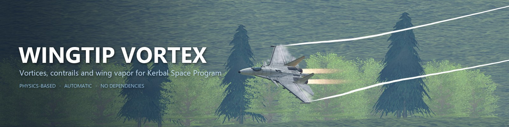

 

**[Download](https://github.com/PogKai/ksp-wingtip-vortex/releases/latest)**
&nbsp;·&nbsp; [Forum thread](https://forum.kerbalspaceprogram.com/topic/230208-ksp-vorticescontrails-mod-release/#comment-4508713)
&nbsp;·&nbsp; [Changelog](CHANGELOG.md)

 

## What it does

Fly. That's it: no menus, no settings, no per-craft setup.

| | |
|---|---|
| **Wingtip vortices** | Twin vortex trails curl in behind the wingtips, stronger the harder the wing is working. On your craft and every aircraft around you, AI wingmen and BDArmory opponents included. Works on multi-part wings, canards and rockets |
| **Wing vapor** | The white sheet over the wings in a hard pull. It is *hard to get*, on purpose |
| **Wake behaviour** | Trails spread as they age, the ground pushes them apart, and a heavily loaded core can burst |

 

## Install

1. Download the zip from the [latest release](https://github.com/PogKai/ksp-wingtip-vortex/releases/latest)
2. Copy the `WingtipVortex` folder (inside the zip's `GameData`) into your KSP `GameData/`
3. Fly

KSP 1.12.x · no dependencies · to upgrade, replace the folder · to remove, delete it.

 

## New in 1.3.0

* **Vortices on every aircraft** around you, not just the one you fly. Switching craft no longer resets any wake
* **Vortices form like real ones**: a thin, faint thread at the wingtip that builds up behind it, and a much gentler spiral breakdown
* **BDArmory**: wing vapor stays on the jet when the camera follows a missile, and AI craft spawned in the air are measured correctly
* Everything else in the [changelog](CHANGELOG.md)

 

## Good to know

* Needs **stock aerodynamics**. Works alongside Scatterer, EVE, Parallax, Deferred, Singularity and Kopernicus
* Vortex placement and wing vapor need the stock lifting modules, so they don't appear under **Ferram Aerospace Research**

 

## Learn more

| | |
|---|---|
| [How it works](docs/how-it-works.md) | The physics behind the vortices and the wake |
| [Wing vapor](docs/wing-vapor.md) | How it forms, what to expect, and its limits |
| [Troubleshooting](docs/troubleshooting.md) | Logs, known issues, and how to report a problem |
| [Changelog](CHANGELOG.md) | Every release |

 

## License

[CC BY-NC-SA 4.0](license.md): free to use and share, never to sell. You can:

| | |
|---|---|
| **Use it** | In your own game, videos, streams and screenshots |
| **Change it** | Fork it, modify it, fix it, build on it |
| **Share it** | Redistribute it, or bundle it in a free modpack |
| **Reuse the code** | Put any part of it in your own free mods and projects |

As long as you:

* **Credit PogKai** and link back to this repository
* **Don't sell it**, or anything built from it, or put it behind a paywall
* **Use the same license** for anything you share that's built from it

Versions up to 1.2.0 were released under MIT and stay under it. Everything after is CC BY-NC-SA 4.0.

 

## Free, always

Every version of this mod is free. I have never charged for it and never will. If you paid for it anywhere, that money didn't go to me. Get it from the [official releases](https://github.com/PogKai/ksp-wingtip-vortex/releases) or the [forum thread](https://forum.kerbalspaceprogram.com/topic/230208-ksp-vorticescontrails-mod-release/#comment-4508713).

 

## AI disclosure

This mod was built with help from Claude, Anthropic's AI assistant.

| | |
|---|---|
| **With Claude** | Research support, baseline code, and debugging |
| **Me (PogKai)** | The ideas and the direction of the project, my own research, core integration into KSP, and all in-game testing |

Every feature was tested and tuned by hand in game before it shipped.

 

CC BY-NC-SA 4.0 · by PogKai

<!--
Screenshot slots: add images to docs/images/ and uncomment.

<table>
<tr>
<td></td>
<td></td>
</tr>
<tr>
<td align="center">Wing vapor in a hard pull</td>
<td align="center">Vortices on a slow approach</td>
</tr>
</table>
-->
